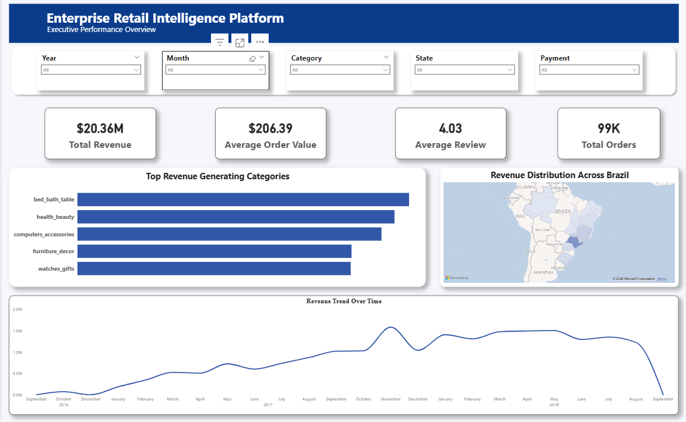
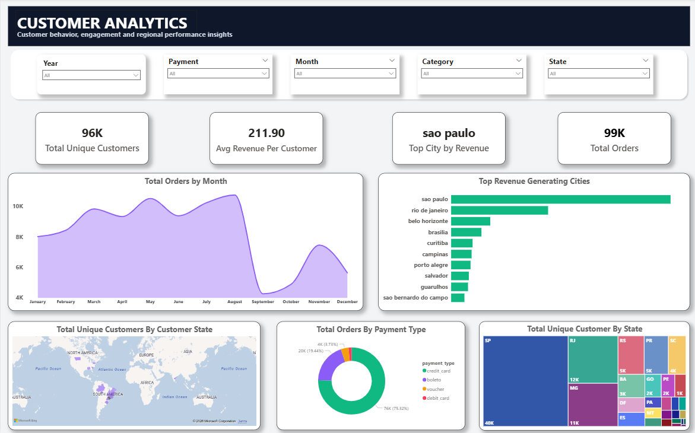
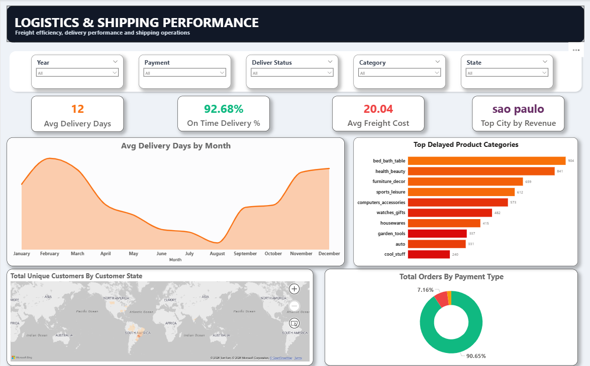
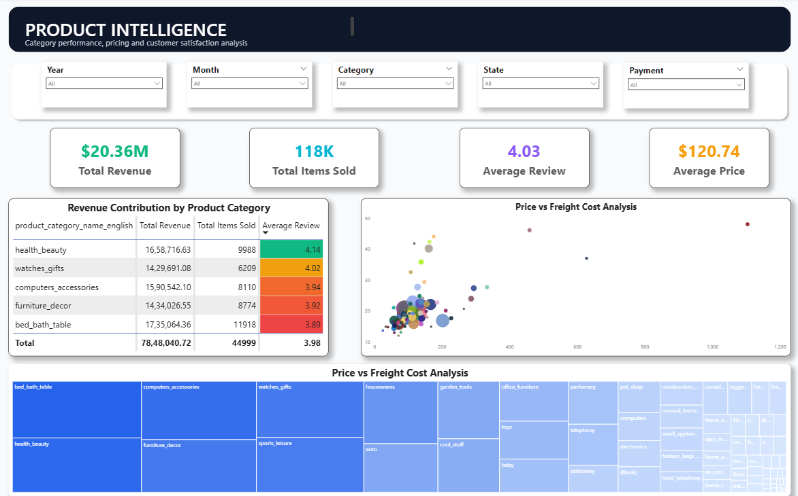
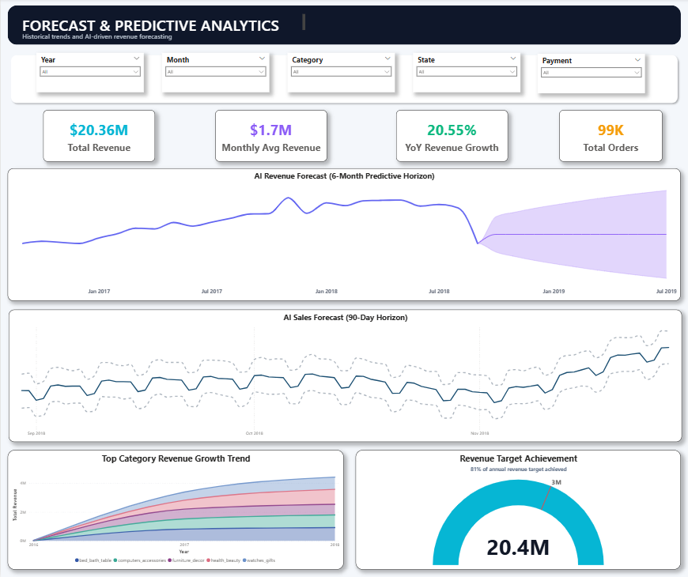

# Enterprise Retail Intelligence Command Centre

## *A complete data platform I built from scratch — CSV files to executive dashboards*

---

# The Short Version

## What is this?

I built an end-to-end analytics platform for an e-commerce company. Think of it as what a Data Engineer + Analyst + Data Scientist would build at a real company.

---

## Why did I build it?

I wanted to prove I can handle the **entire** data pipeline — not just one piece.

From messy CSVs → clean SQL warehouse → executive dashboards → AI/ML predictions.

---

## What did I actually do?

| Step | What I built | Why it matters |
|------|--------------|----------------|
| 1 | Python scripts that read 1M+ rows of CSVs | Show I can code data pipelines |
| 2 | A SQL Server database with 8 tables | Show I understand databases |
| 3 | A Star Schema (`dim_` and `fact_` tables) | Show I know Data Warehousing |
| 4 | 5 Power BI dashboards with DAX measures | Show I can build executive reports |
| 5 | ML models that predict sales + find VIPs + flag churn | Show I understand Data Science |
| 6 | Docker containers that package everything | Show I know DevOps basics |

---

## The honest result

This took me 10 days to build.

I ran into:
- duplicate review IDs
- SQL connection issues
- Power BI relationship nightmares
- dashboard beautification problems
- C-drive storage crashes
- overfitted ML models

I fixed them all.

And now I have a portfolio project that proves I can actually do this job.

---

# The Business Problem I Solved

## The Scenario (Real Company, Real Data)

A Brazilian e-commerce marketplace called **Olist** provided the dataset.

The data included:
- 9 CSV files
- 100,000+ orders
- customers from all over Brazil
- products in Portuguese (which I had to translate)

---

## The Questions They Asked

| Business Question | Dashboard |
|---|---|
| How much money are we making, and is it growing? | Revenue Dashboard |
| Who are our best customers, and where do they live? | Customer Analytics |
| Are our deliveries getting slower or faster? | Logistics Dashboard |
| What products should we stock more of? | Product Intelligence |
| What will sales look like next quarter? | Forecast Dashboard |

---

## What I Delivered

| Dashboard | What it shows | Real insight found |
|---|---|---|
| Executive Overview | Revenue trends + KPI cards + geo analysis | São Paulo alone generated \$2.7M revenue |
| Customer Analytics | Customer behavior + geography + payment insights | 93K customers, mostly one-time buyers |
| Logistics & Shipping | Delivery performance + freight cost analysis | Delivery times increased from 12 → 14 days |
| Product Intelligence | Product performance + review analysis | Health & Beauty became the #1 category |
| Forecast & Predictions | AI-powered revenue forecasting | Model predicted future Black Friday spikes |

---

# How I Built It (The Technical Story)

---

# Phase 1 — Getting the Data In

## The problem

9 CSV files with:
- different formats
- duplicate values
- missing values
- inconsistent schemas

---

## What I did

I wrote Python ETL scripts that:

1. Read each CSV using Pandas
2. Validated missing values and duplicates
3. Logged all operations for debugging
4. Loaded cleaned data into SQL Server staging tables

---

## The bug that almost made me quit

The file:

```text
olist_order_reviews_dataset.csv
```

contained duplicate `review_id` values.

SQL Server rejected inserts because:
- primary keys must be unique

I spent 2 hours debugging before realizing the issue.

---

## The fix

```python
df_reviews = df_reviews.drop_duplicates(subset=['review_id'])
```

---

# Phase 2 — Building the Data Warehouse

## The challenge

Staging tables are terrible for analytics.

I needed:
- fast queries
- clean joins
- scalable reporting

So I designed a proper **Star Schema**.

---

## The structure

```text
┌──────────────┐     ┌──────────────┐
│ dim_customers│     │ dim_products │
│ - customer_key│    │ - product_key│
│ - city/state │     │ - category   │
└──────┬───────┘     └──────┬───────┘
       │                    │
       └──────────┬─────────┘
                  ▼
       ┌─────────────────────┐
       │     fact_orders      │
       │ - order_id           │
       │ - customer_key       │
       │ - product_key        │
       │ - seller_key         │
       │ - time_key           │
       │ - price              │
       │ - freight_value      │
       │ - payment_value      │
       │ - review_score       │
       └──────────┬──────────┘
                  │
       ┌──────────┴──────────┐
       ▼                     ▼
┌──────────────┐     ┌──────────────┐
│  dim_sellers │     │   dim_time   │
│ - seller_key │     │ - time_key   │
│ - city/state │     │ - year/month │
└──────────────┘     └──────────────┘
```

---

## Why this matters

Power BI can query Star Schemas in milliseconds.

Messy staging tables make dashboards slow and frustrating.

This architecture is the difference between:
- professional BI systems
- beginner dashboards

---

## The hardest part

The raw data used Portuguese category names like:

```text
beleza_saude
```

I joined translation tables to convert them into:

```text
health_beauty
```

so dashboards would make sense to English-speaking stakeholders.

---

# Phase 3 — SQL Analytics

---

## Question 1 — Are we growing month-over-month?

### Query

```sql
WITH MonthlyRevenue AS (
    SELECT 
        YEAR(dt.order_purchase_timestamp) AS year,
        MONTH(dt.order_purchase_timestamp) AS month,
        SUM(f.payment_value) AS revenue
    FROM fact_orders f
    JOIN dim_time dt 
        ON f.time_key = dt.time_key
    WHERE f.order_status = 'delivered'
    GROUP BY 
        YEAR(dt.order_purchase_timestamp),
        MONTH(dt.order_purchase_timestamp)
)

SELECT 
    year,
    month,
    revenue,
    LAG(revenue) OVER (
        ORDER BY year, month
    ) AS last_month_revenue,

    ROUND(
        (
            (revenue - LAG(revenue) OVER (ORDER BY year, month))
            /
            NULLIF(LAG(revenue) OVER (ORDER BY year, month), 0)
        ) * 100,
        2
    ) AS growth_percent

FROM MonthlyRevenue
ORDER BY year, month;
```

---

## What this taught me

Window functions like `LAG()` are incredible for:
- trend analysis
- forecasting
- time-series comparisons

---

## Question 2 — Who are our best customers?

### Query

```sql
SELECT TOP 10
    c.customer_city,
    COUNT(DISTINCT f.order_id) AS total_orders,
    SUM(f.payment_value) AS total_revenue,
    AVG(f.review_score) AS avg_rating

FROM fact_orders f

JOIN dim_customers c
    ON f.customer_key = c.customer_key

WHERE f.order_status = 'delivered'

GROUP BY c.customer_city
ORDER BY total_revenue DESC;
```

---

## The insight that surprised me

São Paulo generated:
- \$2.7M revenue

Rio generated:
- only ~\$250K

That gap was much larger than expected.

---

## Question 3 — Are deliveries getting slower?

### Query

```sql
SELECT 
    YEAR(order_purchase_timestamp) AS year,
    COUNT(*) AS total_delivered,

    AVG(
        DATEDIFF(
            DAY,
            order_purchase_timestamp,
            order_delivered_customer_date
        )
    ) AS avg_delivery_days

FROM stg_orders

WHERE order_status = 'delivered'
AND order_delivered_customer_date IS NOT NULL

GROUP BY YEAR(order_purchase_timestamp)
ORDER BY year;
```

---

## The scary truth

Delivery times increased:
- 12 days in 2016
- 14 days in 2018

The company was scaling...
but logistics performance was declining.

---

# Phase 4 — Power BI Dashboards

Raw numbers are boring.

Executives want:
- visuals
- interactivity
- storytelling
- actionable insights

---

# Dashboard 1 — Executive Overview



## What's on it

- KPI cards
- revenue trend analysis
- Brazil revenue heatmap
- top categories
- dynamic slicers

---

## Core DAX Measure

```DAX
Total Revenue = SUM(fact_orders[payment_value])
```

Simple measure.
Foundation of the entire reporting system.

---

# Dashboard 2 — Customer Analytics



## What's on it

- unique customer analysis
- customer growth trends
- top customer cities
- payment behavior segmentation
- geographic distribution

---

## Key Insight

Most customers buy once and never return.

This suggests:
- customer acquisition matters more than retention
- marketplace behavior differs from subscriptions

---

# Dashboard 3 — Logistics & Shipping



## Challenge

Delivery dates were NOT inside my fact table.

---

## Solution

Used Power Query to merge:
```text
stg_orders
```

into:
```text
fact_orders
```

using:
```text
order_id
```

---

## Delivery Status Logic

```DAX
Delivery Status =
IF(
    ISBLANK([Actual Delivery Days]),
    "In Transit",

    IF(
        [Actual Delivery Days] <= [Estimated Delivery Days],
        "On Time",
        "Late"
    )
)
```

---

## What it revealed

- 90.65 % on-time or early deliveries
- 9.34 % late or in-transit

Delivery performance falling as order volume increased.

---

# Dashboard 4 — Product Intelligence



## Features

- category treemaps
- review-score heat formatting
- product profitability analysis
- freight vs price comparison

---

## Key Insight

Health & Beauty became:
- highest revenue category
- strong review performer

Computers had:
- great reviews
- low sales volume

Potential marketing opportunity.

---

# Dashboard 5 — Forecast & Predictions



## How I built it

Used Power BI's native AI forecasting engine.

```text
Analytics Pane → Forecast → 6 Months → 95% Confidence
```

---

## What it predicts

- future revenue growth
- seasonal spikes
- confidence intervals

---

## Why executives care

Executives don't only want:
```text
What happened?
```

They want:
```text
What WILL happen?
```

---

# Phase 5 — Machine Learning

Reporting the past is useful.

Predicting the future is better.

---

# Model 1 — Sales Forecasting with Prophet

## What it does

Predicts daily revenue for the next 90 days.

---

## Code

```python
from prophet import Prophet

model = Prophet(
    yearly_seasonality=True,
    weekly_seasonality=True
)

model.fit(df_daily_revenue)

future = model.make_future_dataframe(periods=90)

forecast = model.predict(future)
```

---

## What it predicted

Black Friday 2018 revenue spike:
- approximately \$74,000

---

## The coolest part

I never explicitly told Prophet about Black Friday.

The model learned seasonal behavior automatically.

---

# Model 2 — Customer Segmentation with K-Means

## Objective

Group customers based on purchasing behavior.

---

## RFM Features

| Feature | Meaning |
|---|---|
| Recency | Days since last purchase |
| Frequency | Number of purchases |
| Monetary | Total money spent |

---

## Segments Discovered

| Segment | Count | Avg Spend | Meaning |
|---|---|---|---|
| Recent Buyers | 51,959 | \$199 | Warm leads |
| Lost Customers | 38,579 | \$199 | Need win-back campaigns |
| Loyal Customers | 2,797 | \$436 | Repeat buyers |
| Whale VIPs | 22 | \$26,932 | Massive revenue generators |

---

## Biggest insight

0.02% of customers generated nearly 4% of revenue.

VIPs matter enormously.

---

# Model 3 — Churn Prediction with Random Forest

## Business Problem

Acquiring new customers costs significantly more than retaining existing ones.

Goal:
- identify customers likely to leave

---

## Initial Mistake (Data Leakage)

I accidentally included:
```text
Recency
```

inside the churn model.

The model achieved:
```text
100% accuracy
```

Which was fake.

Why?

Because churn itself was defined using recency.

I accidentally gave the model the answer.

---

## The fix

Removed Recency from training.

Accuracy dropped:
- from 100%
- to 70%

Much more realistic.

---

## Feature Importance

| Feature | Importance |
|---|---|
| Monetary | 99.5% |
| Avg Review Score | 0.4% |
| Frequency | 0.1% |

---

# Phase 6 — Automation with Airflow

## The problem

I didn't want to run scripts manually every day.

---

## Solution

Built an Airflow DAG pipeline.

---

## Workflow

```text
Step 1: Ingest CSV files
        ↓
Step 2: Build Star Schema
        ↓
Step 3: Run ML models in parallel
        ↓
Step 4: Execute data quality checks
```

---

## Schedule

```text
Every day at 6:00 AM
```

---

## DAG Code

```python
with DAG(
    dag_id='retail_pipeline',
    schedule_interval='0 6 * * *',
    catchup=False,
) as dag:

    task_ingest >> task_transform >> [
        task_forecast,
        task_segmentation,
        task_churn
    ] >> task_quality
```

---

# Phase 7 — Docker

## The problem

"It works on my machine" is not acceptable.

---

## What I containerized

- SQL Server
- Python environment
- Airflow
- ML dependencies
- analytics services

---

## The Docker bug that nearly broke me

SQL Server couldn't write to Windows-mounted volumes due to permission issues.

---

## The fix

```yaml
sqlserver:
  user: "0:0"
```

---

## Final result

Anyone can run:

```bash
docker-compose up -d
```

and launch the full platform.

---

# What I Learned

---

## What went well

- Star Schema dramatically improved Power BI speed
- Prophet forecasting worked surprisingly well
- Docker simplified deployment

---

## What was difficult

- Power BI relationship debugging
- many-to-many joins
- ML data leakage
- Docker permissions on Windows

---

## What I'd improve next time

- more logging
- proper unit tests
- stronger date dimension architecture

---

# What I'm proud of

I finished it.

From:
```text
9 CSV files
```

to:
```text
1 SQL warehouse
5 dashboards
3 ML models
1 automated platform
```

I can explain every single component in this repository.

---

# Skills Demonstrated

| Skill | Where |
|---|---|
| Python & Pandas | `scripts/ingestion/` |
| SQL Analytics | `sql/queries/` |
| Star Schema Design | `sql/schema/` |
| Power BI & DAX | `dashboards/` |
| Machine Learning | `notebooks/` |
| Docker | `Dockerfile` |
| Airflow | `airflow/dags/` |

---

# About Me

I enjoy building systems that solve real business problems.

Not just writing code —
but building complete analytics platforms.

---

## Looking for (roles)

- Data Analyst
- Analytics Engineer
- Data Engineer
- Data Scientist
- Junior AI Engineer

---

# Connect With Me

| Platform | Link |
|---|---|
| LinkedIn | https://www.linkedin.com/in/yash-rathi0207/|
| GitHub | https://github.com/YashRathi0206 |
| Email | yashrathi7658@gmail.com |

---

# Final Note

I built this project because I wanted to prove I could.

If you're hiring —
I'd genuinely love to show what I can build for your team.